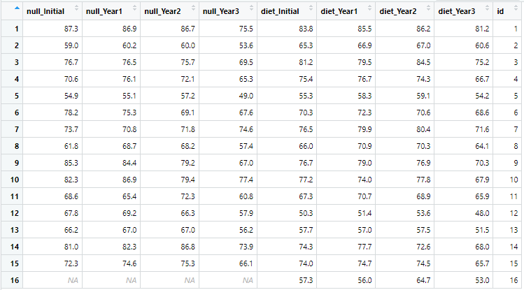
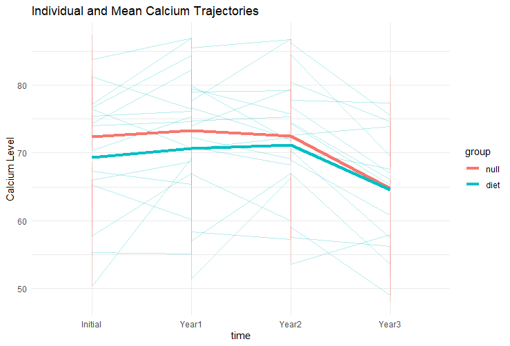

## 1. Busiest Airports Analysis:


```{r}
#| echo: false
#| warning: false
#| message: false
#| label: tbl-airport
#| tbl-cap: "Passenger traffic (In Millions) for the Top six busiest airports (2020–2025)"

library(knitr)
library(tidyverse)
library(rvest)

# Step 1: Load Data ----
wiki_page <- read_html("https://en.wikipedia.org/wiki/List_of_busiest_airports_by_passenger_traffic")

# Step 2: Scrape all tables ----
wiki_tables <- wiki_page |>
  html_elements(css = "table.wikitable") |>
  html_table(convert = TRUE)

# we can use length(wiki_tables) to check how many tables exist

#save each table alone
t2025 <- wiki_tables[[1]]
t2024 <- wiki_tables[[2]]
t2023 <- wiki_tables[[3]]
t2022 <- wiki_tables[[4]]
t2021 <- wiki_tables[[5]]
t2020 <- wiki_tables[[6]]

#add columns to each with the correct year
t2025$year <- 2025
t2024$year <- 2024
t2023$year <- 2023
t2022$year <- 2022
t2021$year <- 2021
t2020$year <- 2020

#combining the data into one dataset
airport_data <- bind_rows(
  t2025,
  t2024,
  t2023,
  t2022,
  t2021,
  t2020
)

#cleaning the data and orgnizing it
airport_data_clean <- airport_data |>
  separate_wider_delim(
    `Code(IATA/ICAO)`, delim = "/", names = c("IATA", "ICAO")
    ) |>
  mutate(
    Totalpassengers = Totalpassengers |>
      str_remove_all("\\[.*?\\]") |>   # removes [##]
      str_remove_all(",") |>   # remove commas
      str_trim() |>
      as.numeric()
  ) |>
  mutate(
    `%change` = `%change` |>
      str_remove_all("%") |>
      str_trim() |>
      as.numeric()
  )

busiest_airports <- airport_data_clean |>
  filter(IATA %in% c("ATL", "FRA", "PKX", "DFW", "HND", "DXB")) |>
  select(Airport, IATA, year, Totalpassengers) |>
  pivot_wider(
    names_from = year,
    values_from = Totalpassengers
  ) |>
  arrange(IATA)
  
busiest_airport_table <- busiest_airports |>
  mutate(
    across(`2020`:`2025`, ~ as.character(round(.x / 1000000, 1)))
  )


busiest_airport_table |> 
  kable(align = c("l", "c", "r", "r", "r", "r", "r", "r"))
```


```{r}
#| echo: false
#| warning: false
#| message: false
#| label: fig-airport
#| fig-cap: "Passenger traffic trends for the Top six busiest airports (2020–2025)"
#| fig-pos: H

busiest_airports |>
  pivot_longer(
    cols = `2020`:`2025`,
    names_to = "year",
    values_to = "Totalpassengers"
  ) |>
  ggplot(aes(x = year, y = Totalpassengers, color = IATA, group = Airport)) +
  geom_line() +
  geom_point() +
  scale_y_continuous(labels = scales::comma) +
  labs(
    title = "Passenger Traffic (2020-2025)",
    x = "Year",
    y = "Total Passengers",
    color = "Airport"
  )
```

For this section, we collected the data from a Wikipedia page. This data was filtered to only include six airports to show the passenger flow that they had during 2020 to 2025. 
With a quick look at @tbl-airport, we notice that **Beijing Daxing International Airport (PKX)** is the only airport in this list that has missing data in 2020, 2022, and 2023.
We can also see that **Hartsfield–Jackson Atlanta International Airport (ATL)** has the highest passenger traffic across all the years, exceeding 100M passenger in 2023, 2024, and 2025. With the highest record on 2024.

Looking at @fig-airport, we can get a better idea of how passenger traffic changed over time. All airports show a low start in 2020. This shows the impact of COVID-19 that effected the global travel. We also notice that after 2020, there is a steady increase in passengers across all airports.

When we compare 2020 and 2021 data between all the airports, we notice that airports within the United States did face the same drop in numbers as the ones outside of the United States. For example, **Dubai International Airport (DXB)**, **Beijing Daxing International Airport (PKX)**, **Frankfurt Airport (FRA)**, and **Tokyo Haneda Airport (HND)** had a decrease during 2021, but their recovery rate was the highest in the next years and were able to catch up with the United States airport. This shows that the world and the global traffic had a strong recovery after 2021.


## 2. Monte Carlo Numerical Integration:

Monte Carlo numerical integration works by randomly generating points inside a defined rectangle with x-bounds from 0 to 4 and y-bounds from 0 to 0.8. Each generated point is then checked to see if it falls under the curve or above it. If it falls under the curve, it is colored green, and if it falls above the curve, it is colored red. This is done by comparing the y-value of the point to the function value at that x. The points tell us the proportion, and we use that proportion to estimate the rectangle’s area under the curve. It is all done using randomness instead of a fixed rule.

```{r}
#| echo: false
#| warning: false
#| message: false

library(ggplot2)

the_points_function <- function(xbounds, ybounds, n){
  
  x <- runif(n, min = xbounds[1], max = xbounds[2])
  y <- runif(n, min = ybounds[1], max = ybounds[2])
  
  data.frame(x = x, y = y)
}

xbounds <- c(0, 4)
ybounds <- c(0, 0.8)

weibull_function <- function(x){
  dweibull(x, shape = 1.5, scale = 1)
}

mc_plot_function <- function(n){
  
  pts <- the_points_function(xbounds, ybounds, n)
  
  pts$under_curve <- pts$y <= weibull_function(pts$x)
  
  rect_area <- (xbounds[2] - xbounds[1]) * (ybounds[2] - ybounds[1])
  p <- mean(pts$under_curve)
  estimate <- p * rect_area
  
  ggplot(pts, aes(x = x, y = y)) +
    geom_point(aes(color = under_curve), alpha = 0.6, size = 1) +
    stat_function(fun = weibull_function, color = "blue", linewidth = 1) +
    scale_color_manual(values = c("red", "green")) +
    labs(
      x = "x",
      y = "y"
    ) +
    theme_minimal() +
    theme(legend.position = "none")
}

plot10 <- mc_plot_function(10)
plot100 <- mc_plot_function(100)
plot1000 <- mc_plot_function(1000)
plot10000 <- mc_plot_function(10000)
```

```{r}
#| echo: false
#| label: fig-monte-carlo
#| fig-cap: "Monte Carlo integration of the Weibull density at different resolutions."
#| layout-ncol: 2
#| fig-pos: H
#| fig-subcap: 
#|   - "n = 10, est = 0.64"
#|   - "n = 100, est = 0.8"
#|   - "n = 1,000, est = 0.992"
#|   - "n = 10,000, est = 0.9987"

plot10
plot100
plot1000
plot10000
```

The value under the curve should equal to 1, because the area under the curve would equal to 1.

The estimates in Figure @fig-monte-carlo are increasing in stability as the number of points is increasing. The first plot, **(a) with n=10**, gives an estimate that is close to random, which is not reliable. The second plot, **(b) with n=100**, is a little better but still varies due to randomness. In the third plot, **(c) with n=1,000**, the estimate gets much closer to one and starts to stabilize. In the last plot, **(d) with n=10,000**, we notice that the value is the closest to one.


## 3. Planning and Prompting GenAI Tools:

### Plan

**Goals:**
- We want to tidy the calcium dataset so it is easier to work with, compare calcium levels across time, compare the two treatment groups (null vs diet/exercise), and finally create a visualization that will show us how calcium changes over time for each group

**Needs:**
- calcium.csv Data
- Columns for time and treatment group
- Tidy format
- Functions: read, pivot, mutate, plot
- Variables: year, calcium level, treatment group

**Steps:**
1. Srart with loading the dataset into R
2. Rename the columns so they clearly show Initial, Year1, Year2, Year3
3. Separate the null group and diet/exercise group
4. Add a column called treatment_group to label each group
5. Combine both groups into one dataset
6. Convert the data from wide format to long format
7. Create a column for time (Initial, Year1, Year2, Year3)
8. Create a visualization (line or boxplot) comparing calcium levels over time by treatment group
9. Check if the plot clearly shows differences between the two groups and adjust if needed

### Plan-Informed GenAI Response **(ChatGPT)**

I decided to use ChatGPT and gave it a prompt with my plan with the calcium.csv file. 

### Generic Prompt Response

Bellow is ChatGPT output when a generic prompt was used without a plan.





ChatGPT gave chunks of R code, I ran them through RStudio to generate the above plot.

The response seems to have a structure and broken down to follow the main goals I gave it. However, the data is still not fully tidy at this stage. Each time point (Initial, Year1, Year2, Year3) is still stored as separate columns, which means the data is still in a wide format instead of a long format. The output I wanted should have one column for time, one column for group type, and one column for calcium values.


## 4. Reflection:

In this course, I learned how to take messy data and turn it into something I can actually work with. I was able to learn about scraping data and improve my skills in cleaning and organizing data. Clean data make doing analysis easier. The airports dataset was a good example to work on and test these skills. We worked on other datasets like diamonds and penguins too.

I also got better at creating visualizations that actually help explain what is going on in the data. I learned how to use tools like Esquisse, which helped me explore different types of plots. I also feel like my code has been improving; it became easier for me to know what steps i need to solve the problems i have with datasets.

\newpage

## GenAI Usage Appendix

### Usage: Generating R code to tidy calcium.csv dataset

- **Tool:** ChatGPT
- **Date:** 16 April 2026

**Prompt:**
I am working with a dataset called calcium.csv that have two groups: (1) a null treatment group and (2) a diet/exercise group. The dataset is not tidy because the first four columns represent measurements (Initial, Year1, Year2, Year3) for the null group, and the next four columns represent the same measurements for the diet/exercise group.

I want to tidy and analyze this dataset using R code.

Here is my plan:

My goals are to start with tidying the calcium dataset so it is easier to analyze, compare calcium levels across time (Initial, Year1, Year2, Year3), compare the two treatment groups (null vs diet/exercise), and end with creating a visualization to show how calcium levels change over time for each group.


**Response:**

You’re on exactly the right track—this dataset is a classic “wide” format problem. The key is to reshape it into a tidy “long” format where each row is one observation (one person at one time point in one group). After that, analysis and plotting become much easier.

Here’s a clean, step-by-step R workflow you can follow.


1. Load packages and data


library(tidyverse)

calcium <- read.csv("calcium.csv")


2. Add an ID column

Since your dataset doesn’t have subject IDs, create one so repeated measures stay linked.


calcium <- calcium %>%
  mutate(id = row_number())


3. Rename columns for clarity

Right now you have duplicated names like `y0, y1...`. Let’s distinguish groups.


colnames(calcium) <- c(
  "null_Initial", "null_Year1", "null_Year2", "null_Year3",
  "diet_Initial", "diet_Year1", "diet_Year2", "diet_Year3",
  "id"
)


4. Convert to tidy (long) format

This is the most important step.


calcium_long <- calcium %>%
  pivot_longer(
    cols = -id,
    names_to = c("group", "time"),
    names_sep = "_",
    values_to = "calcium"
  )


Now your data looks like:

id
group (null vs diet)
time (Initial, Year1, Year2, Year3)
calcium (value)


5. Clean factors (ordering matters for plots)


calcium_long <- calcium_long %>%
  mutate(
    group = factor(group, levels = c("null", "diet")),
    time = factor(time, levels = c("Initial", "Year1", "Year2", "Year3"))
  )


6. Summary statistics

Compare groups over time:


summary_stats <- calcium_long %>%
  group_by(group, time) %>%
  summarise(
    mean_calcium = mean(calcium, na.rm = TRUE),
    sd_calcium = sd(calcium, na.rm = TRUE),
    n = n(),
    .groups = "drop"
  )

print(summary_stats)


7. Visualization (key goal)

This gives you a clean trend comparison:


ggplot(summary_stats, aes(x = time, y = mean_calcium, group = group, color = group)) +
  geom_line(size = 1.2) +
  geom_point(size = 3) +
  labs(
    title = "Calcium Levels Over Time by Treatment Group",
    x = "Time",
    y = "Mean Calcium Level",
    color = "Group"
  ) +
  theme_minimal()


8. (Optional but powerful) Individual trajectories

This shows variation within groups:


ggplot(calcium_long, aes(x = time, y = calcium, group = id, color = group)) +
  geom_line(alpha = 0.3) +
  stat_summary(aes(group = group), fun = mean, geom = "line", size = 1.5) +
  labs(
    title = "Individual and Mean Calcium Trajectories",
    y = "Calcium Level"
  ) +
  theme_minimal()


9. (Optional) Statistical comparison

If you want to formally test differences:


anova_model <- aov(calcium ~ group * time + Error(id/time), data = calcium_long)
summary(anova_model)


What you’ve achieved

Converted messy wide data → tidy long format
Enabled group/time comparisons
Built a clear visualization of trends
Set up for proper repeated-measures analysis


If you want, I can help you interpret the results or upgrade this to a mixed-effects model (which is often better than ANOVA for this kind of data).

\newpage

## Code Appendix

### Busiest Airports Code:

```{r}
#| echo: true
#| eval: false

library(knitr)
library(tidyverse)
library(rvest)

# Step 1: Load Data ----
wiki_page <- read_html("https://en.wikipedia.org/wiki/List_of_busiest_airports_by_passenger_traffic")

# Step 2: Scrape all tables ----
wiki_tables <- wiki_page |>
  html_elements(css = "table.wikitable") |>
  html_table(convert = TRUE)

# we can use length(wiki_tables) to check how many tables exist

#save each table alone
t2025 <- wiki_tables[[1]]
t2024 <- wiki_tables[[2]]
t2023 <- wiki_tables[[3]]
t2022 <- wiki_tables[[4]]
t2021 <- wiki_tables[[5]]
t2020 <- wiki_tables[[6]]

#add columns to each with the correct year
t2025$year <- 2025
t2024$year <- 2024
t2023$year <- 2023
t2022$year <- 2022
t2021$year <- 2021
t2020$year <- 2020

#combining the data into one dataset
airport_data <- bind_rows(
  t2025,
  t2024,
  t2023,
  t2022,
  t2021,
  t2020
)

#cleaning the data and orgnizing it
airport_data_clean <- airport_data |>
  separate_wider_delim(
    `Code(IATA/ICAO)`, delim = "/", names = c("IATA", "ICAO")
    ) |>
  mutate(
    Totalpassengers = Totalpassengers |>
      str_remove_all("\\[.*?\\]") |>   # removes [##]
      str_remove_all(",") |>   # remove commas
      str_trim() |>
      as.numeric()
  ) |>
  mutate(
    `%change` = `%change` |>
      str_remove_all("%") |>
      str_trim() |>
      as.numeric()
  )

busiest_airports <- airport_data_clean |>
  filter(IATA %in% c("ATL", "FRA", "PKX", "DFW", "HND", "DXB")) |>
  select(Airport, IATA, year, Totalpassengers) |>
  pivot_wider(
    names_from = year,
    values_from = Totalpassengers
  ) |>
  arrange(IATA)
  
busiest_airport_table <- busiest_airports |>
  mutate(
    across(`2020`:`2025`, ~ as.character(round(.x / 1000000, 1)))
  )


busiest_airport_table |> 
  kable(align = c("l", "c", "r", "r", "r", "r", "r", "r"))
```

```{r}
#| echo: true
#| eval: false

busiest_airports |>
  pivot_longer(
    cols = `2020`:`2025`,
    names_to = "year",
    values_to = "Totalpassengers"
  ) |>
  ggplot(aes(x = year, y = Totalpassengers, color = IATA, group = Airport)) +
  geom_line() +
  geom_point() +
  scale_y_continuous(labels = scales::comma) +
  labs(
    title = "Passenger Traffic (2020-2025)",
    x = "Year",
    y = "Total Passengers",
    color = "Airport"
  )
```

### Monte Carlo Code:

```{r}
#| echo: true
#| eval: false

library(ggplot2)

the_points_function <- function(xbounds, ybounds, n){
  
  x <- runif(n, min = xbounds[1], max = xbounds[2])
  y <- runif(n, min = ybounds[1], max = ybounds[2])
  
  data.frame(x = x, y = y)
}

xbounds <- c(0, 4)
ybounds <- c(0, 0.8)

weibull_function <- function(x){
  dweibull(x, shape = 1.5, scale = 1)
}

mc_plot_function <- function(n){
  
  pts <- the_points_function(xbounds, ybounds, n)
  
  pts$under_curve <- pts$y <= weibull_function(pts$x)
  
  rect_area <- (xbounds[2] - xbounds[1]) * (ybounds[2] - ybounds[1])
  p <- mean(pts$under_curve)
  estimate <- p * rect_area
  
  ggplot(pts, aes(x = x, y = y)) +
    geom_point(aes(color = under_curve), alpha = 0.6, size = 1) +
    stat_function(fun = weibull_function, color = "blue", linewidth = 1) +
    scale_color_manual(values = c("red", "green")) +
    labs(
      x = "x",
      y = "y"
    ) +
    theme_minimal() +
    theme(legend.position = "none")
}

plot10 <- mc_plot_function(10)
plot100 <- mc_plot_function(100)
plot1000 <- mc_plot_function(1000)
plot10000 <- mc_plot_function(10000)
```

```{r}
#| echo: true
#| eval: false
#| fig-subcap: 
#|   - "n = 10, est = 0.64"
#|   - "n = 100, est = 0.8"
#|   - "n = 1,000, est = 0.992"
#|   - "n = 10,000, est = 0.9987"

plot10
plot100
plot1000
plot10000
```